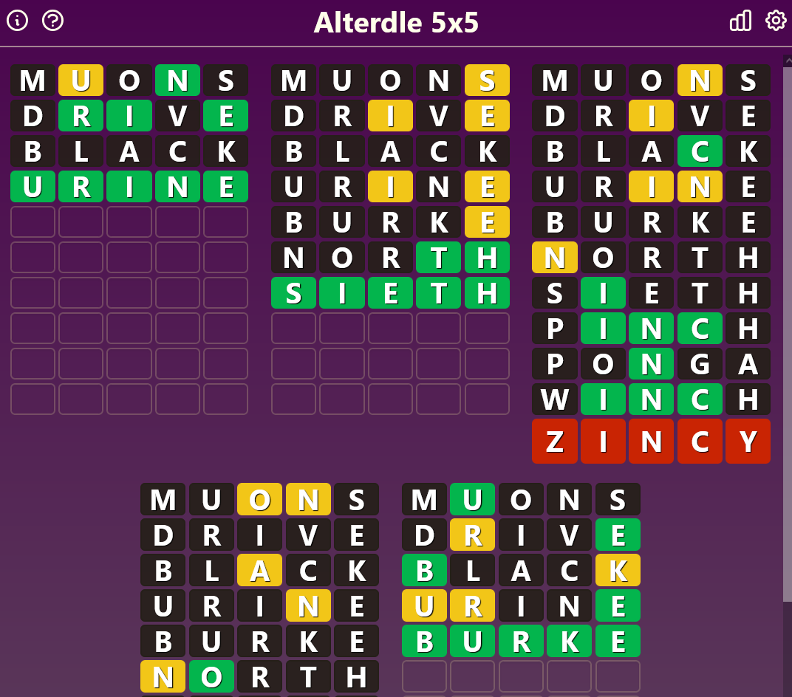

# Alterdle

Alterdle is a fully customisable word guessing game.

For the first time ever it allows users to choose how many words to guess at once (between 1 and 16) as well as how long each word is (between 1 and 11 letters), resulting in 162 unique daily puzzles!!

This game chooses words at random, so it will occasionally choose obscure or inappropriate ones. If you find a particularly offensive wordplease consider contributing to the project.

[**Try out Alterdle!**](https://alterdle.bonefiend.com/)

## Features

### Full customisation:

### Correct word animations:

### Detailed stats for each game setting:

###### Plus a hidden poem!
